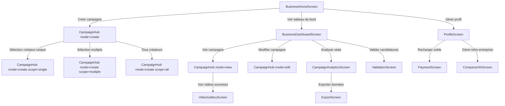
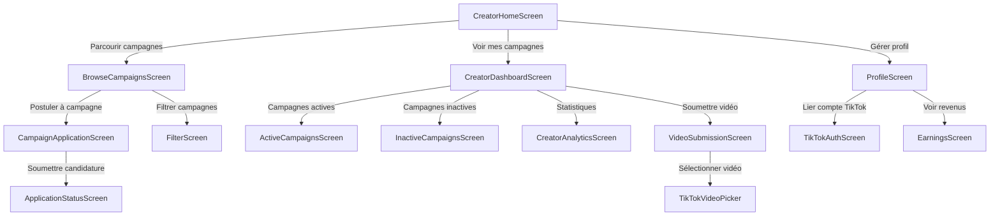

# Table of Contents
1. [Présentation Kolabo](#1)
2. [Workflow de Navigation Principal](#2)
3. [Modification et Conceptions à faire](#3)

---
---
<a name="2"></a>

# **Présentation Kolabo**  
*L'application qui révolutionne le marketing d'influence en Afrique*


#### **🔄 Concept Central**  
**"Votre produit mérite d'être vu. Votre créativité mérite d'être récompensée."**  
Kolabo crée un pont intelligent entre :  
- **Businesses** cherchant une publicité rentable  
- **Créateurs TikTok** voulant monétiser leur audience  

---

#### **🎯 Problèmes Résolus**  
| Pour les Businesses | Pour les Créateurs |
|---------------------|---------------------|
| ☑️ Coûts publicitaires imprévisibles | ☑️ Difficulté à trouver des collaborations |
| ☑️ Difficulté à mesurer le Retour sur investissement | ☑️ Paiements irréguliers |
| ☑️ Manque de créateurs locaux qualifiés | ☑️ Absence de plateforme dédiée en Afrique |

---

#### **📱 Visuel d'Interface (Vue d'ensemble)**  
```  
[BusinessHomeScreen]       [CreatorHomeScreen]  
┌─────────────────────┐    ┌─────────────────────┐  
│                     │    │                     │  
│                     │    │                     │  
│                     │    │                     │  
│                     │    │                     │  
│                     │    │                     │  
│                     │    │                     │  
│                     │    │                     │  
└─────────────────────┘    └─────────────────────┘  
```

---

#### **💡 Fonctionnalités Clés**  
**Pour les Businesses**  
- 📊 **Paiement à la performance** : Payez seulement pour les vues réelles  
- 🎯 **Campagnes sur-mesure** : Ciblez 1, plusieurs ou tous les créateurs  
- ⚡ **Validation en 24h** : Contrôle total sur les vidéos soumises  

**Pour les Créateurs**  
- 💰 **Rémunération optimisée** : Algorithmes qui maximisent vos gains  
- 📈 **Portefeuille digital** : Suivez tous vos revenus en temps réel  
- 🚀 **Soumission express** : Importez vos vidéos TikTok en 1 clic  

---

#### **📊 Modèle Économique Unique**  
```  
[Business paie 100,000 FCFA]  
     │  
     ▼  
[Kolabo retient 10% commission]  
     │  
     ▼  
[90,000 FCFA distribués aux créateurs]  
     │  
     ▼  
[Rémunération = f(vues, engagement, qualité)]  
```

---

#### **🌍 Impact Spécifique au Marché Africain**  
1. **Monétisation locale** : Paiements en FCFA/XOF via Mobile Money  
2. **Publicité contextuelle** : Campagnes adaptées aux réalités locales  
3. **Écosystème francophone** : Plateforme 100% en français  

---

#### **📌 Pourquoi Kolabo ?**  
> "Nous transformons les vues TikTok en résultats concrets avec un système équitable où tout le monde gagne :  
> - Les businesses **payent seulement pour des résultats**  
> - Les créateurs sont **récompensés à leur juste valeur**  
> - L'économie numérique africaine **se développe**"  

---
---
<a name="2"></a>

# **Workflow de Navigation Principal**

#### A. Flux Business



#### B. Flux Créateur



#### **C. Workflow Typique**

**1. Business Lance Une Campagne:**
```
BusinessHomeScreen
→ Sélection créateurs 
→ CampaignHub (création) 
→ Définition budget/consignes 
→ Validation 
→ BusinessDashboardScreen (suivi)
```

**2. Créateur Postule et Soumet:**
```
BrowseCampaignsScreen 
→ Filtrage 
→ CampaignApplicationScreen 
→ Attente validation 
→ NotificationCenter (acceptation) 
→ VideoSubmissionScreen 
→ TikTokVideoPicker 
→ Soumission vidéo
```

**3. Suivi et Paiement:**
```
BusinessDashboardScreen 
→ Validation vidéo 
→ CampaignAnalyticsScreen (suivi vues) 
→ Paiement automatique après 7 jours 
→ CreatorDashboardScreen (revenus)
→ PaymentScreen (retrait)
```

---
---
<a name="3"></a>

# **Modification et Conceptions à faire**

#### **1. BusinessHomeScreen (VOUKS)**
**Objectif** : Page d'accueil pour les entreprises  
**Fonctionnalités** :
- Affichage du nom de l'entreprise et résumé des collaborations
- Options de lancement rapide de campagne :
  - Campagne pour un seul créateur
  - Campagne pour créateurs sélectionnés
  - Campagne pour tous les créateurs
- Recherche et sélection de créateurs avec filtres
- Accès rapide au tableau de bord et au profil  
**Structure UI** :
- En-tête avec bienvenue personnalisé
- Cartes d'action rapide (3 colonnes)
- Barre de recherche de créateurs
- Liste scrollable de créateurs avec avatars et stats
- Bouton "Créer une campagne" contextuel

---

#### **2. CreatorHomeScreen**
**Objectif** : Hub principal pour les créateurs de contenu  
**Fonctionnalités** :
- Campagnes recommandées (popularité/rémunération)
- Accès aux campagnes en cours de l'utilisateur
- Bouton "Parcourir toutes les campagnes"
- Statistiques rapides (revenus estimés, campagnes actives)
- Notifications des candidatures acceptées/rejetées  
**Structure UI** :
- Section "Campagnes populaires" (carrousel horizontal)
- Section "Mes campagnes" (liste verticale)
- Widget de stats personnelles
- Boutons d'action principaux en fixed footer

---

#### **3. CampaignHub (VOUKS)**
**Objectif** : Gestion centralisée des campagnes  
**Modes supportés**:
- **Création** : Formulaire multi-étapes pour nouvelles campagnes
- **Consultation** : Détails complets d'une campagne existante
- **Édition** : Modification des campagnes non actives
- **Statistiques** : Analytics pour campagnes en cours
- **Soumission** : Depot de vidéos par les créateurs  
**Structure UI** :
- Header dynamique selon le mode
- Navigation par étapes pour la création
- Sections repliables pour chaque type de campagne
- Prévisualisation des documents joints
- Barre de progression pour les uploads

---

#### **4. CreatorDashboardScreen**
**Objectif** : Tableau de bord des activités créateur  
**Fonctionnalités** :
- Onglets : Actives/Inactives/Statistiques
- Liste des campagnes avec statut de participation (validé/en attente/rejeté)
- Accès rapide à la soumission vidéo
- Graphiques de revenus et performance
- Historique des paiements  
**Structure UI** :
- Sélecteur d'onglets sticky
- Cartes de campagnes avec indicateurs de statut
- Section statistiques avec graphiques circulaires/barres
- Tableau d'historique financier

---

#### **5. BusinessDashboardScreen (VOUKS)**
**Objectif** : Centre de contrôle pour entreprises  
**Fonctionnalités** :
- Vue consolidée des campagnes (actives/archivées)
- Validation des candidatures créateurs
- Analyse des performances vidéo
- Gestion des paiements et solde
- Téléchargement de rapports  
**Structure UI** :
- Dashboard avec widgets synthétiques
- Tableau des créateurs en attente de validation
- Lecteur vidéo intégré pour prévisualisation
- Module de rechargement de solde

---

#### **6. ProfileScreen**
**Objectif** : Gestion du compte utilisateur  
**Fonctionnalités communes** :
- Édition des informations personnelles
- Gestion du solde et historique financier
- Connexion/déconnexion TikTok (créateurs)
- Paramètres de notification  
**Spécificités Business** :
- Gestion des informations entreprise
- Coordonnées bancaires  
**Spécificités Créateurs** :
- Statistiques TikTok (abonnés, engagement)
- Portfolio des vidéos  
**Structure UI** :
- Section profil avec avatar éditable
- Cartes thématiques (Infos perso, Compte, Notifications)
- Module de recharge avec historique des transactions

---

#### **7. BrowseCampaignsScreen**
**Objectif** : Découverte des campagnes pour créateurs  
**Fonctionnalités** :
- Filtres (récompense, type, date)
- Recherche par mot-clé
- Système de favoris
- Candidature simplifiée en 1 clic  
**Structure UI** :
- Barre de recherche sticky
- Filtres fixes sur le côté gauche
- Grille de cartes de campagnes avec badge "Nouveau"
- Pagination infinie

---

#### **8. VideoSubmissionScreen (VOUKS)**
**Objectif** : Soumission des vidéos TikTok  
**Fonctionnalités** :
- Intégration API TikTok (liste des vidéos)
- Sélection multiple de vidéos
- Association à une campagne spécifique
- Prévisualisation avant soumission
- Suivi du statut de validation  
**Structure UI** :
- Gallery view des vidéos TikTok
- Panneau latéral pour sélection de campagne
- Modal de confirmation avec résumé
- Historique des soumissions

---

#### **9. CampaignAnalyticsScreen (VOUKS)**
**Objectif** : Analyse approfondie des performances  
**Fonctionnalités** :
- Métriques clés (vues, engagement, coût/vue)
- Comparaison entre créateurs
- Projection des revenus
- Téléchargement des données brutes
- Alertes de performance  
**Structure UI** :
- Tableau de bord avec KPI en header
- Graphiques interactifs (courbes, camemberts)
- Classement des créateurs
- Sélecteur de périodes personnalisées

--- 

#### **10. NotificationCenterScreen**
**Objectif** : Hub des interactions système  
**Fonctionnalités** :
- Catégorisation (validations, paiements, alertes)
- Marquer comme lue/archivée
- Actions rapides (approuver candidatures)
- Historique sur 90 jours  
**Structure UI** :
- Liste groupée par catégorie
- Badges de statut non-lu
- Filtres par type et date
- Bouton "Tout marquer comme lu"
